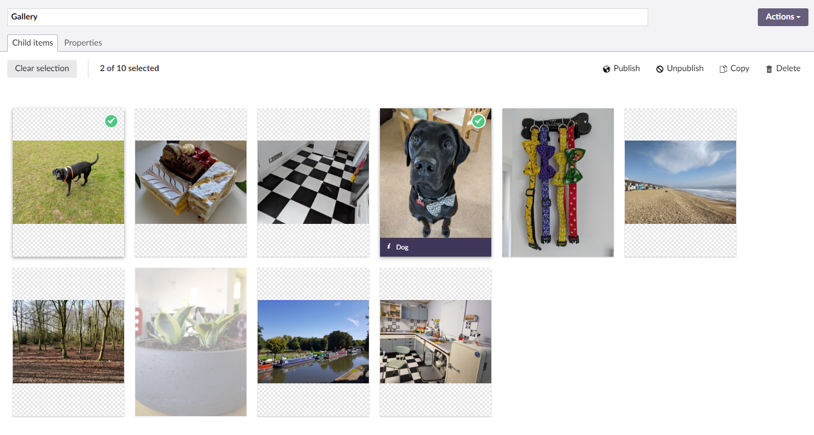
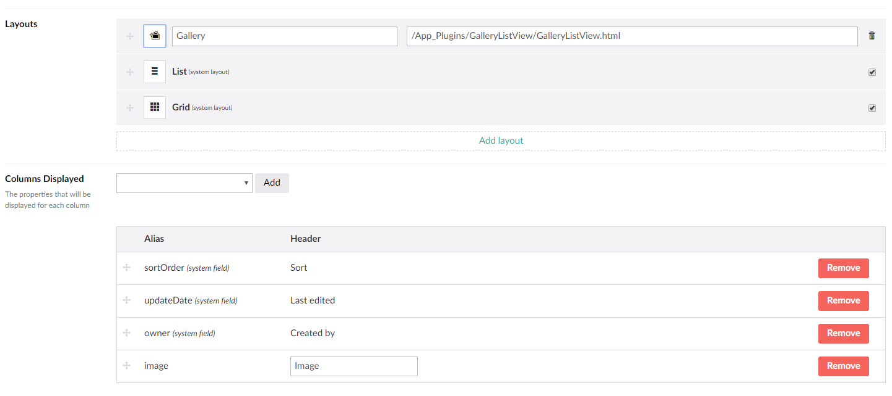

# Umbraco GalleryListView

A simple app_plugin for Umbraco that allows you to view a ListView in the style of the Media Library. 

### Screenshot

### DataType

This plugin was originally taken from this blog post and altered to match the media library styling 
https://24days.in/umbraco-cms/2016/custom-list-view-layouts/

 